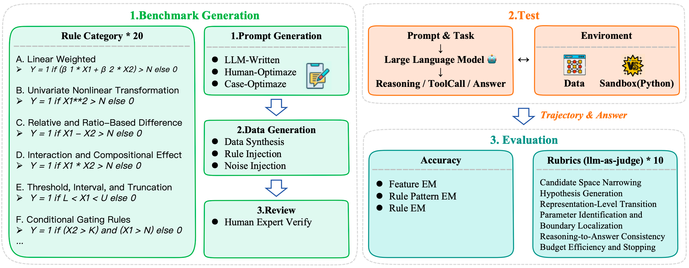
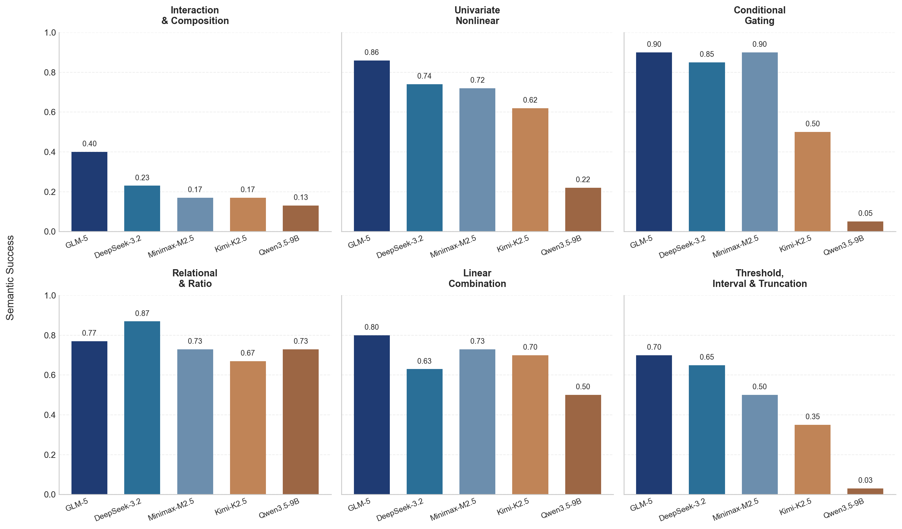
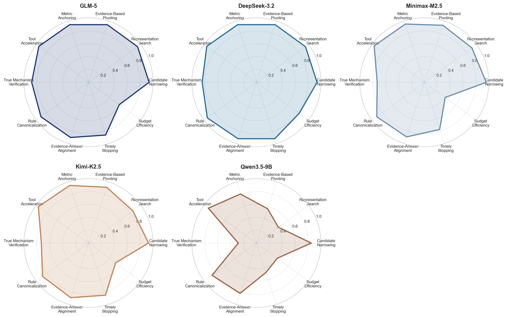

# MiningBench: An Interactive Data Mining Evaluation Benchmark for Multi-turn Reasoning and Tool Usage

Evaluates LLM agents on open-ended, multi-step data mining tasks — specifically *rule/factor discovery*. Agent must write and execute Python code across multiple turns to uncover hidden rules from tabular data.







---

## Overview

### Why Data Mining?

- **No single solution path** — requires heuristic, exploratory reasoning
- **Unplanned difficulty** — task hardness is unknown at the start; the model must adapt based on feedback
- **High-dimensional action space** — correlation analysis, tree models, SHAP, feature engineering, etc.
- **Sparse intermediate signals** — unlike math proofs, partial solutions rarely give clear correctness cues
- **Noisy real-world data** — ground-truth rules are obscured by noise

### Bench Design

Each task presents the model with a CSV file containing `N` feature columns and one `target` column. The model must identify the single hidden rule that generated `target`.

| Family | Rules | 
|-|---|
| Linear Weighted | Single-var threshold, dual-var linear, triple-var linear | 
| Univariate Nonlinear | Cubic, square, sqrt, absolute deviation, log | 
| Relative / Ratio | Log-ratio, difference, squared ratio | 
| Interaction & Combination | Product, linear+interaction, quadratic cross | 
| Threshold & Interval | Center deviation, max-cut, single-sided interval, double-sided interval | 
| Conditional Gate | AND gate, OR gate | 

### Bench Scale

| Split | Cnt | Difficulty | Task Type |
|---|---|---|---|
| Version01: anonymous | 200 | Easy*40 + Medium*70 + Hard*90  | Classification * 170 + Regression * 30 |
| Version02: Semantic | ...ongoing | ... | ... |
| Total | 200 |

JSONL schema:

```json
{
  "id": "nb_v1_task_0001",
  "split": "anonymous",
  "difficulty": "medium",
  "input_data_path": "task_01/data.csv",
  "ground_truth": {
    "rule_name": "双变量线性与交互混合规则",
    "task_type": "classification",
    "answer_features": ["feat_1", "feat_4"],
    "answer_rule": "target = 1 if (2*feat_1 + -3*feat_4 + feat_1*feat_4) > 7 else 0"
  }
}
```

---

## Repository Structure

```
├── MiningBench/                  # Benchmark generator & raw data
│   ├── MiningBench-v1/           # Generated task data (CSV files + JSONL)
│   ├── MiningBench-v1-task_generator.py
│   └── ...
├── mint-bench/                   # Evaluation framework (built on MINT)
│   ├── mint/                     # Core framework code
│   │   ├── agents/               # LLM agent implementations
│   │   ├── configs/              # Config registry & generator
│   │   ├── tasks/                # Task definitions
│   │   ├── utils/                # Utility functions (e.g., code execution)
│   │   └── main.py               # Main entry point
│   ├── rubric/                   # Trajectory quality rubric evaluator
│   │   ├── score_trajectory_rubric.py
│   │   └── trajectory_rule_discovery_rubric.jsonl
│   ├── scripts/                  # Evaluation & analysis scripts
│   │   ├── run.sh                # Batch execution script with multi-worker support
│   │   └── miningbench_to_mint_json.py  # Convert MiningBench to MINT-JSONL
│   ├── configs/                  # Generated experiment config files
│   └── data/
│       ├── processed/            # Formatted task prompts
│       └── outputs/              # Model rollout results
```

---

## Quick Start

### 1. Env 

```bash
git clone https://github.com/Zhuang-Zhuang-Liu/MiningBench.git
cd MiningBench/mint-bench
conda env create -f environment.yml
conda activate mint
pip install -e .
```

### 2. Prepare Data

```bash
python3 data-process/miningbench_to_mint_json.py \
  --input MiningBench/MiningBench-v1/benchmark.jsonl \
  --output mint-bench/data/processed/mining-bench/test_prompts.json \
  --data-root MiningBench/MiningBench-v1
```

### 3. Generate Experiment Configs

Edit `mint-bench/mint/configs/config_variables.py` 

```python
{
    "agent_class": "VLLMAgent",   # for local OpenAI-compatible servers
    "config": {
        "model_name": "your-model-id",
        "chat_mode": True,
        "max_tokens": 512,
        "temperature": 0.0,
        "openai.api_base": "http://localhost:1234/v1",
        "add_system_message": False,
    },
},
```

This generates config files under `configs/<model_name>/...`

```bash
PYTHONPATH=$(pwd) python3 mint/configs/generate_config.py
```

### 4. Run Rollout

```bash
PYTHONPATH=$(pwd) python3 mint/main.py \
  --exp_config configs/qwen/qwen3.5-9b/F=None/max20_p1+tool+cd/reasoning_da/mining-bench.json

PYTHONPATH=$(pwd) python3 mint/main.py --debug \
  --exp_config configs/<model_name>/.../<task>.json
```

**Multi-worker parallel execution** (recommended for batch evaluation):

```bash
# Run with 8 parallel workers
PYTHONPATH=$(pwd) python3 mint/main.py \
  --exp_config configs/qwen/qwen3.5-9b/F=None/max20_p1+tool+cd/reasoning_da/mining-bench.json \
  --num_workers 8

# Adjust num_workers based on your hardware and API rate limits
PYTHONPATH=$(pwd) python3 mint/main.py \
  --exp_config configs/<model_name>/.../<task>.json \
  --num_workers <N>
```

### 5. Evaluation

**Rule-based evaluation**:

- Success Rate: Fraction of samples whose predicted rule is semantically correct under the evaluator
- Feature Set Accuracy: Whether the model identified the exact set of correct feature variables
- Near Miss Rate: Fraction of non-perfect executable samples that still achieve very high accuracy / very low RMSE


```bash
python3 scripts/eval_mining_bench.py data/outputs
# Output: `data/outputs/<model_name>/results.merged.rule_eval.jsonl` and `.md`
```

---

**Trajectory rubric evaluation** (LLM-as-judge):

```bash
export MININGEVAL_API_KEY='YOUR_API_KEY'
python3 mint-bench/rubric/score_trajectory_rubric.py \
  mint-bench/data/outputs/<model_name>/results.merged.jsonl \
  --mode online
```

---
**Outputs JSONL files**:

```
data/outputs/<model_name>/F=None/max20_p1+tool+cd/reasoning_da/mining-bench/
├── results.jsonl              # raw trajectories
├── results.merged.jsonl       # merged multi-run results
├── results.merged.rule_eval.jsonl   # rule accuracy scores
├── results.merged.rule_eval.md      # human-readable summary
└── output.txt                 # execution log
```

---

## Trajectory Rubrics

1. **Candidate Space Reduction** — Does the model efficiently narrow down variables early?
2. **Representation Exploration** — Does the model test diverse functional forms (linear, nonlinear, interaction)?
3. **Evidence-Based Hypothesis Pivoting** — Does the model switch direction based on data signals rather than randomly?
4. **Metric-Anchored Key Decisions** — Are accept/reject decisions backed by concrete metrics?
5. **Computational Tool Leverage** — Does the model use statistical tools, ML models, or enumeration effectively?
6. **Post-Fit Mechanism Verification** — After finding a high-fit formula, does the model verify it is the true mechanism?
7. **Rule Expression Normalization** — Is the final rule compact, reproducible, and clearly expressed?
8. **Submission-Evidence Consistency** — Does the final answer align with intermediate reasoning?
9. **Stopping Quality** — Does the model stop once the rule is sufficiently stabilized?
10. **Budget Hygiene** — Does the model avoid repeated invalid or wasteful actions?

---


## 🤝 Main contributors
<table border="0">
  <tbody>
    <tr align="center">
      <td width="130">
        <a href="https://github.com/Zhuang-Zhuang-Liu"></a><br>
        <a href="https://github.com/Zhuang-Zhuang-Liu">ZhuangZhuangLiu</a>
        <p> We Lab </p>
      </td>
      <td width="150">
        <a href="https://github.com/jd-SearchEngines"></a><br>
        <a href="https://github.com/jd-SearchEngines">Jingdong Deng</a>
        <p> Shopee </p>
      </td>
    </tr>
  </tbody>
</table>


## Citation

If you use MiningBench in your research, please cite:

```bibtex
@misc{miningbench2026,
  title   = {MiningBench: An Interactive Data Mining Evaluation Benchmark for Multi-turn Reasoning and Tool Usage},
  author  = {},
  year    = {2026},
  note    = {https://github.com/Zhuang-Zhuang-Liu/MiningBench}
}
```

This project builds on the [MINT](https://arxiv.org/abs/2309.10691) evaluation framework:

```bibtex
@misc{wang2023mint,
  title   = {MINT: Evaluating LLMs in Multi-turn Interaction with Tools and Language Feedback},
  author  = {Xingyao Wang and Zihan Wang and Jiateng Liu and Yangyi Chen and Lifan Yuan and Hao Peng and Heng Ji},
  year    = {2023},
  eprint  = {2309.10691},
  archivePrefix = {arXiv},
  primaryClass  = {cs.CL}
}
```

---

## License

This project is licensed under the MIT License. See [mint-bench/LICENSE](mint-bench/LICENSE) for details.
